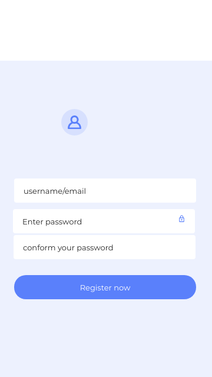
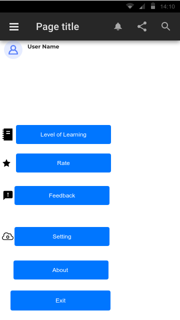

Quiz app

_Gyalpozhing College of Information
Technology(Bachelor of Science in Information
Technology(BScIT)) Year 2 (Android project for QUIZ) Project_

# Description

Tell me and I forget, teach me and I remember. It involves me and I learn”. Android is the other dominant player in this space, it was a bit later participant to the game, first being released in Sept 2008, virtually a year later than iOS but it has managed to achieve a reasonably massive share of the mobile market. Quiz App is a language learning platform and it is designing for new learner to develop the basic concept about the language form the beginner to the intermediate levels.

As a student we have to learn so many things and we refer so many websites and application and sometimes we feel that our hunger for the learning dies. Not finding the right and good required lessons. Although there are some applications but those application does not provide enough features for learning and some are there but to learn fully we do not find effective by the end and again interest in learning is not upgraded. On contradictory different people need different lessons to learn meaning familiarity with the learning platform.

# Technology Used

2. Android Studio
3. FireBase

## Screenshoot of Quiz Application

  
  
  
  
  
  
  

  
  
  
  
  

# Conclusion

1. The main focus of the application will be based on the the python learning. The concept will be delivered and moreover the maximum concept will based on the real life problem. The user can actively participate and engage in learning. With the problem the solutions are provided thus user can actively learn.

2. Although researchers predict that mobile learning has outstandingly influence on education (Alden, 2013) but design and development of mobile learning application consider as complicated progress for many institutions. One main challenge is to identify how to design application development environments able to support integration of such technologies through intuitive mobile interactive environments. Moreover, regarding to limitations of learning tools such as mobile application, fast and endlessly changes, there are priorities in design and development phase between content and context, instruction,interface, learning approach and... . “How do I create an environment to teach what I am trying to teach? The conundrum lies in the struggle between the ideal learning environment and the pragmatic solution based on available resources. Should an educator first consider technological decisions or traditional

3. This quiz application will help to learn in different stages with interactive questions and with the solutions thus it will be easy for the learner to get the ideas. And moreover it will add user with the new skills and knowledge.
